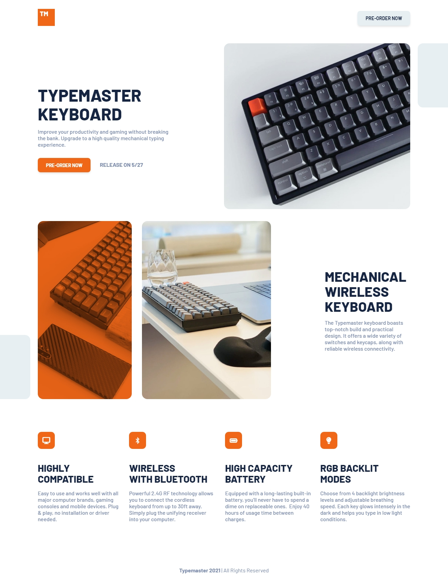

# Frontend Mentor - Typemaster pre-launch landing page solution

  

This is a solution to the [Typemaster pre-launch landing page challenge on Frontend Mentor](https://www.frontendmentor.io/solutions/typemaster-prelaunch-landing-page-solution-iGV6vrULW7). Frontend Mentor challenges help us to improve our coding skills by building realistic projects.   

## Built with

- Semantic HTML5 markup
- CSS custom properties
- SCSS
- Flexbox
- CSS Grid
- Mobile-first workflow

Preview it here - [Typemaster pre-launch landing page solution](https://id-dev3.github.io/Typemaster-pre-launch-landing-page/)   

## Author

- Website - [Idris](https://id-dev3.github.io/)
- Frontend Mentor - [@BlackFury117](https://www.frontendmentor.io/profile/BlackFury117)
- Twitter - [@id_dev3](https://www.twitter.com/id_dev3)